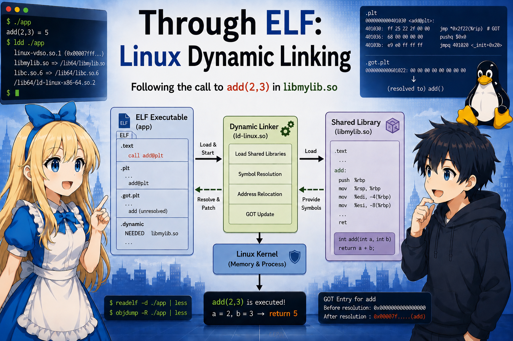

# ELF で追う Linux 動的リンク

[English (英語)](README.md) | **日本語**

2 つのファイル `main.c` と `mylib.c` が用意されており、`main.c` は実行ファイル `main` に、`mylib.c` は共有ライブラリ `libmylib.so` にビルドされる。`main` は `libmylib.so` を使うが、`main` 自体に `libmylib.so` は含まれていない。

## 題材

```c
// mylib.c → libmylib.so
int add(int a, int b) { return a + b; }
```

```c
// main.c → main
int add(int, int);
int main(void) { return add(2, 3); }
```

これら 2 つのファイル (`main` と `libmylib.so`) を本書では **題材** と
呼ぶ。`main` の中に `add` の実体はないのに、`./main` を実行すると
`5` が返ってくる。この呼び出しが内部で成立する仕組み、すなわち
**動的リンク** を、題材を元に追いかける。


## 全体像

```
   +------------------------+
   | Kernel (Linux)         |   ELF を解釈してメモリにマップし、
   |                        |   制御を ld-linux.so に渡す
   +------------------------+

   +------------------------+
   | Dynamic Linker         |   実体は /lib64/ld-linux-x86-64.so.2
   | "ld-linux.so"          |   依存ライブラリのロードとシンボル解決を担う
   +------------------------+

   +------------------------+
   | main (ELF)             |   私たちが書いた実行ファイル
   +------------------------+

   +------------------------+
   | libmylib.so (ELF)      |   私たちが書いた共有ライブラリ
   +------------------------+
```

## 目次

| 章 | 内容 |
|---|---|
| [01 ELF ヘッダ](docs/ja/01_elf_header.md) | 先頭 64 バイトの構造 |
| [02 プログラムヘッダ](docs/ja/02_program_header.md) | PT_LOAD / PT_INTERP / PT_DYNAMIC とメモリ配置 |
| [03 動的リンカの起動](docs/ja/03_dynamic_linker_startup.md) | カーネル → ld-linux.so のバトン |
| [04 .dynamic セクション](docs/ja/04_dynamic_section.md) | 動的リンクに必要なメタデータの目次 |
| [05 シンボル解決](docs/ja/05_symbol_resolution.md) | libmylib.so の `.dynsym` から `add` を引く手順 |
| [06 PLT / GOT](docs/ja/06_plt_got.md) | `add` 呼び出しの「橋」の構造 |
| [07 遅延束縛](docs/ja/07_lazy_binding.md) | 初回呼び出しで GOT が書き換わるまで |

## 付録

本筋には不要だが、本文中で参照する補助資料。

| 付録 | 内容 |
|---|---|
| [付録 A 用語と表記の規約](docs/ja/08_notation.md) | `base_main` などのラベル一覧 (随時参照) |
| [付録 B 起動スタックの読み方](docs/ja/09_startup_stack.md) | `argc` / `argv` / `envp` / `auxv` のレイアウト (03 でつまずいたら) |
| [付録 C 自己再配置の仕組み](docs/ja/10_self_relocation.md) | ld-linux.so が自身を書き換える処理の中身 (03 step 1 を深掘り) |
| [付録 D ライブラリのロード順序と lookup scope](docs/ja/11_load_order.md) | `-lmylib` から DT_NEEDED、BFS ロード、lookup scope までの因果連鎖 |

## 環境

| 項目 | 値 |
|---|---|
| OS | Linux |
| アーキテクチャ | x86-64 |
| libc | glibc |
| 実行形式 | **PIE** (位置独立実行ファイル) |
| 動的リンカ | `/lib64/ld-linux-x86-64.so.2` (glibc) |
| 束縛方式 | **lazy binding** |


## 調査に使う道具

調査に利用するコマンド:

```
   readelf -h   ELFヘッダを表示
   readelf -l   プログラムヘッダを表示
   readelf -d   .dynamic を表示
   readelf -s   シンボル表 (.dynsym, .symtab) を表示
   readelf -r   再配置エントリを表示
   objdump -d   逆アセンブル
   hexdump -C   生バイトを 16進で表示
   ldd          依存している .so 一覧
   strace       システムコール (execve, mmap, openat) の追跡
```

## コンパイル＆リンク＆実行

題材のファイルは [`samples/`](samples/) にある。本シリーズに
載せている `readelf` / `objdump` の出力や具体アドレス値は、すべて
GCC 14.3.0 で以下のように生成したサンプルから採っている。

Linux x86-64 環境:

```sh
cd samples
sh build.sh
./main ; echo $?    # 5 が出れば成功
```

macOS など非 Linux 環境では Docker で gcc を借りる:

```sh
cd samples
docker run --rm -v "$PWD":/work -w /work gcc:14-bookworm sh -c "sh build.sh"
```

`libmylib.so` と `main` ができれば、`docs/ja/` 内の `readelf` / `objdump` の
出力をそのまま再現できる (具体値は GCC のバージョンやリンカ設定で多少
変わる)。

## スコープ外 (扱わないもの)

「`add()` を呼び出すまで毎回必ず登場する仕組み」だけを追うため、以下は
あえて扱わない:

- セクションヘッダ全般 / デバッグ情報 (`.debug_*`)
- シンボルバージョニング (`DT_VERSYM`, `DT_VERNEED`)
- TLS の細部、IFUNC、コンストラクタ (`DT_INIT_ARRAY` など)
- 32bit ELF (x86_64 のみ)
- 古い `DT_HASH` アルゴリズム (`DT_GNU_HASH` のみ)
- プリリンク、`LD_PRELOAD` の特殊挙動
- `dlopen` / `dlsym` の API 詳細
- `-z now` (eager binding) — 遅延束縛のみ

## クレジット

- 企画: t-ishii66 (大学で物理を学ぶ。システムエンジニア。英会話奮闘中）
- 設計: t-ishii66
- ドキュメント: Claude Opus4.7, t-ishii66, GPT5.5
- レビュー: t-ishii66
- イラスト: ChatGPT 5.5
- 英語翻訳: Claude Opus4.7
- Copyright(c) 2026 t-ishii66. All rights reserved.
