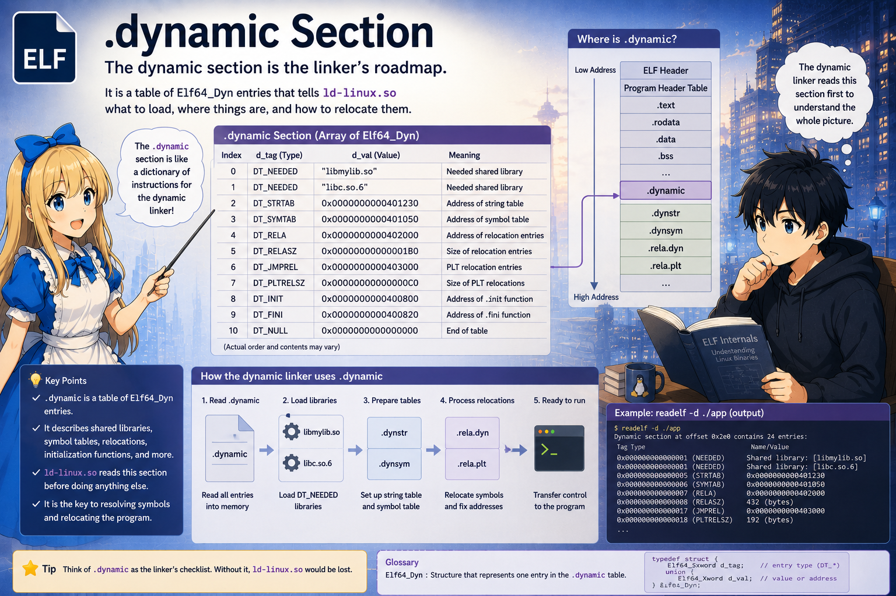

# Step 4. The .dynamic Section

In Step 3, the dynamic linker found the **`PT_DYNAMIC` Program header of `main`**. Its `p_vaddr` points at where the **`.dynamic` section** is placed.

`.dynamic` is the **information for dynamic linking** — a bundle of
entries that summarize where the various tables used in dynamic linking
live. In this chapter, of these, we follow `DT_NEEDED`, which is used to
load dependent libraries (`DT_SYMTAB`, `DT_PLTGOT`, and the other `DT_*`
appear in Step 5 and beyond).

---

## The structure of .dynamic

The content is simple — **an array of `(tag, value)` pairs**.

```c
typedef struct {
    int64_t  d_tag;      // [0..7]  number of DT_NEEDED, DT_STRTAB, ...
    union {
        uint64_t d_val;  // [8..15] when interpreted as an integer value
        uint64_t d_ptr;  // [8..15] when interpreted as a virtual address
    } d_un;
} Elf64_Dyn;             // one entry = 16 bytes
```

For each `d_tag`, whether "`d_un` should be read as an integer / as an
address" is fixed. The array terminates at `d_tag == DT_NULL (0)`.

Put differently, the body of `.dynamic` is an array of `Elf64_Dyn`
lined up in the region that `PT_DYNAMIC`'s `p_vaddr` points to:

```
   +---- Region pointed to by PT_DYNAMIC (Program header)'s p_vaddr ----+
   |                                                                    |
   |   .dynamic  (array of Elf64_Dyn)                                   |
   |                                                                    |
   |   +------+------------------+                                      |
   |   | tag1 | d_val1 or d_ptr1 |                                      |
   |   +------+------------------+                                      |
   |   | tag2 | d_val2 or d_ptr2 |                                      |
   |   +------+------------------+                                      |
   |   |  ... |       ...        |                                      |
   |   +------+------------------+                                      |
   |   |  0   |        0         |   <-- DT_NULL terminator             |
   |   +------+------------------+                                      |
   |                                                                    |
   +--------------------------------------------------------------------+
```

Filling in the actual entries into `.dynamic` of the subject `main`
(excerpt):

```
   .dynamic  (array of Elf64_Dyn)
   +------------+------------------+
   | DT_NEEDED  |  d_val = 107     |   <-- integer (offset pointing to a library name)
   +------------+------------------+
   | DT_NEEDED  |  d_val = 119     |   <-- integer (offset pointing to a library name)
   +------------+------------------+
   | DT_RUNPATH |  d_val = 152     |   <-- integer (offset pointing to a library search path, discussed below)
   +------------+------------------+
   |    ...     |       ...        |
   +------------+------------------+
   | DT_STRTAB  |  d_ptr = 0x478   |   <-- address (location of .dynstr, discussed below)
   +------------+------------------+
   |    ...     |       ...        |
   +------------+------------------+
   |  DT_NULL   |        0         |   <-- terminator
   +------------+------------------+
```

`DT_NEEDED` holds an integer, `DT_STRTAB` holds an address. Combining
these two to extract the dependent library name `"libmylib.so"` is the
subject of the next section.

---

## Following DT_NEEDED

The topic of this chapter is the flow
 **from `DT_NEEDED` all the way to `mmap`-ing the dependent library**.
We take one `DT_NEEDED` from the `.dynamic` of `main` and confirm that
it represents the library name `"libmylib.so"`.

### Raw bytes of `.dynamic` (the head)

A raw-byte peek at `.dynamic` (the first few entries):

```
   Offset       Bytes                                d_tag    d_val/d_ptr
   ---------   ----------------------------------    -------- ------------
   .dynamic +0  01 00 00 00 00 00 00 00              DT_NEEDED
                6b 00 00 00 00 00 00 00                       d_val = 0x6b = 107
   .dynamic +16 01 00 00 00 00 00 00 00              DT_NEEDED
                77 00 00 00 00 00 00 00                       d_val = 0x77 = 119
   .dynamic +32 1d 00 00 00 00 00 00 00              DT_RUNPATH
                98 00 00 00 00 00 00 00                       d_val = 0x98 = 152
                ...
   .dynamic +N  05 00 00 00 00 00 00 00              DT_STRTAB
                78 04 00 00 00 00 00 00                       d_ptr = 0x478
                ...
```

The first `DT_NEEDED`'s `d_val` is just the integer `0x6b` (= 107).
This alone does not become `"libmylib.so"`. This integer is used as an
**offset** into the `.dynstr` that the next `DT_STRTAB` points to.

### DT_STRTAB and .dynstr

`DT_STRTAB`'s `d_ptr` is the address of `.dynstr`. Because `main` is
PIE (`ET_DYN`), the actual VA that we reference in memory at runtime is
**`base_main + d_ptr`** (same treatment as `p_vaddr` in Step 2 or
`st_value` in Step 5; `base_main` is omitted in the figure below).

`.dynstr` is **a region in which NUL-separated strings are simply lined
up**. Given a single integer offset, the bytes from there to the NUL are
one string:

```
   Virtual address  Bytes                                 String
   ---------------  ------------------------------------  -----------------------
   0x478 + 0        00                                    ""
   0x478 + 107      6c 69 62 6d 79 6c 69 62 2e 73 6f 00   "libmylib.so\0"
   0x478 + 119      6c 69 62 63 2e 73 6f 2e 36 00         "libc.so.6\0"
   0x478 + 152      24 4f 52 49 47 49 4e 00               "$ORIGIN\0"
   ...
```

The very first entry in `.dynstr` is, by convention, the empty string
`""`. This same table is reused in Step 5 as the name column of
`.dynsym`.

### Extracting the name from DT_NEEDED

With this, the processing of the first `DT_NEEDED` is:

```
   1. Read the DT_NEEDED entry              -> d_val = 0x6b (= 107)
   2. Read the DT_STRTAB entry              -> d_ptr = 0x478
   3. Read the string at address (0x478 + 107) -> "libmylib.so"
```

With that, we have extracted the library name `"libmylib.so"` from
`DT_NEEDED`.

`readelf -d main` is simply a human-readable rendering of the raw-byte
decode above:

```
$ readelf -d main | grep -E 'NEEDED|STRTAB'
 0x0000000000000001 (NEEDED)  Shared library: [libmylib.so]
 0x0000000000000001 (NEEDED)  Shared library: [libc.so.6]
 0x0000000000000005 (STRTAB)  0x478
```

---

## Library search order

Here we restrict ourselves to the case of **ordinary execution** where
`DT_NEEDED` holds **just a library name** (with no path separator `/`),
as with `libmylib.so`
(we do not cover secure-execution mode, or `DT_NEEDED` with paths, and
similar edge cases).

The order in which the real file is located from the name
`"libmylib.so"`:

```
   1. DT_RPATH                          (Referenced only if there is no DT_RUNPATH — an older mechanism)
   2. Environment variable LD_LIBRARY_PATH
   3. DT_RUNPATH                        Our case: $ORIGIN ($ORIGIN is the directory of the executable)
   4. /etc/ld.so.cache (built by ldconfig)
   5. Default paths such as /lib, /usr/lib
```

`build.sh` passes `-Wl,-rpath,'$ORIGIN'`, but recent linkers write this
out as **`DT_RUNPATH`** (not `DT_RPATH`).
Therefore the priority is:

```
   LD_LIBRARY_PATH  >  DT_RUNPATH ($ORIGIN)  >  ld.so.cache  >  default paths
```

If nothing is set in the environment, **the same directory as main**
(= `$ORIGIN`) becomes the first viable candidate, and because
`libmylib.so` is present there, it is `open()`ed + `mmap()`ed at that
path.

(Put the other way around, if you set
`LD_LIBRARY_PATH=/somewhere`, that gets searched first, and the
`libmylib.so` in `$ORIGIN` becomes hidden.)

---

## The world after the .so files are loaded

We mmap'd `libmylib.so`. The second `DT_NEEDED`, `libc.so.6`, is loaded
by the same procedure (integer offset → name in `.dynstr` → search →
`mmap`). As a result, the virtual address space is:

```
   base_main      +-----------------------------+
                  | main (all PT_LOADs)          |
                  +-----------------------------+

   base_libmylib  +-----------------------------+
                  | libmylib.so (all PT_LOADs)   |  <-- newly mmap'd
                  |   .text (machine code of add)|
                  |   .dynamic, .dynsym, ...    |
                  +-----------------------------+

   base_libc      +-----------------------------+
                  | libc.so.6 (all PT_LOADs)     |  <-- also mmap'd
                  +-----------------------------+

   base_ld        +-----------------------------+
                  | ld-linux.so                 |
                  +-----------------------------+
```

### How each base is determined

The `base_main` / `base_libmylib` / `base_libc` / `base_ld` in the
figure are determined via different routes.
The only one that corresponds to `AT_BASE` (auxv key 7) is **`base_ld`**;
the rest are decided by their own separate routes.

| Name | Base of what | Who decides it | Where does it come from |
|---|---|---|---|
| `base_main` | The head of main's PT_LOAD group | The location the kernel mapped the ELF at (with PIE, jittered by ASLR) | ld-linux.so **derives it by reverse computation from `AT_PHDR`** (the difference between PT_PHDR's `p_vaddr` and `AT_PHDR`) |
| `base_libmylib` | The head of libmylib.so's PT_LOAD group | **The address returned by ld-linux.so's `mmap()`** | Recorded in ld-linux.so's internal link_map |
| `base_libc` | The head of libc.so.6's PT_LOAD group | Same as above | Same as above |
| `base_ld` | The head of ld-linux.so's own PT_LOAD group | The location the kernel mmap'd ld-linux.so at | Passed by the kernel via **`AT_BASE` (= auxv key 7)** |

Key points:

- **`AT_BASE` is information for ld-linux.so only**. It is needed for
  ld-linux.so to know "where I myself was loaded" and to run its own
  self-relocation.
- **main's base** is not `AT_BASE`; it is derived by reverse computation
  from `AT_PHDR`
  (what Step 3 said is passed via auxv from the kernel is `AT_PHDR`,
  not `AT_BASE`, for main).
- **A `.so`'s base** is entirely a user-space affair — it is the value
  determined at the moment ld-linux.so calls `mmap()`, not something the
  kernel passes via auxv.
  ld-linux.so records this in an internal data structure called
  **link_map**.

For each `.so` too, ld-linux.so again reads **that `.so`'s `.dynamic`**,
and if there is a `DT_NEEDED`, loads it recursively. This way all
dependent libraries end up in memory (= the **link_map** is completed).

---

## What we nailed down this time (points to carry into the next chapter)

```
   [x] .dynamic is an array of (tag, value) pairs. Terminated by DT_NULL
   [x] By applying DT_NEEDED (integer offset) to the .dynstr that DT_STRTAB points to,
       the library name is extracted
   [x] .dynstr is a table of concatenated NULL-separated strings (reused in Step 5)
   [x] rpath / runpath / LD_LIBRARY_PATH are used to find the real file and mmap it
   [x] Each .so's base is determined via its own route, all consolidated in the link_map
```

Next is **Step 5: Symbol resolution** — now that `libmylib.so` is
loaded, we follow the procedure of looking up the address of the `add`
function inside it.
