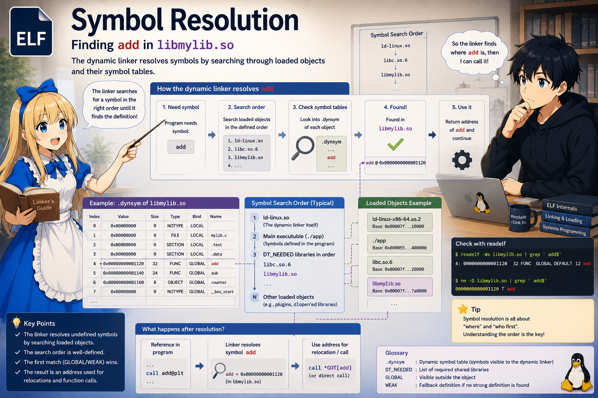

# Step 5. Symbol Resolution

In Step 4 we pinned down the location and structure of `.dynstr` (the
string table). In this chapter, we add `.dynsym` (the symbol table) to
that and follow the procedure of **"looking up a function address
inside `libmylib.so` from the string `"add"`"**. This is the core of
dynamic linking.

Simply walking `.dynsym` from the beginning is enough to **grasp the
essence of dynamic linking**. This chapter explains things with this
naive walk. The actual glibc uses a hash mechanism called `.gnu.hash`
to speed it up, but we only touch on that at the end of the chapter.

---

## The problem we want to solve

The machine code of `main` is trying to call the function `add`, but
`main` itself does not know `add`'s address. In `main`'s `.dynsym`,
`add` is listed by name only, as an "undefined symbol (UND)":

```
   readelf -s --dyn-syms main:
       Num:   Value  Size  Type   Bind   Ndx   Name
       ...
         3:   0x0    0     FUNC   GLOBAL UND   add
```

`FUNC` = function, `UND` = undefined (`SHN_UNDEF`). Looking up which
ELF the definition of `add` lives in, starting from here, is the
subject of this chapter.

---

## Lookup scope: which .so files are searched, in what order

When ld-linux.so looks up a symbol, it consults the **lookup scope**
(= search range) held by the calling ELF (in concrete terms, it is the
list pointed to by the `l_scope` field of the `link_map` that
ld-linux.so holds for each ELF. Details in Step 7).
In our subject, `add` is called from within `main`, so we search
`main`'s lookup scope from the top down:

```
   main's lookup scope:
       1. main itself                -> no "add" (only UND)
       2. libmylib.so                -> "add" found!  end here
       (3. libc.so.6                 -> not tried)
       (4. ld-linux.so               -> not tried)
```

**The first `.so` that hits wins** — this is why "library load order
affects behavior". How that load order is concretely determined
(specification of `-l` → `DT_NEEDED` → order of lookup scope) is
followed in [Appendix D](./11_load_order.md).

From here on we focus on **"how to find `"add"` inside a single `.so`"**.

---

## The two tables used for the search

Inside a single `.so`, the bare minimum needed to find a symbol is 2:

| Table | Meaning |
|---|---|
| `.dynstr` | The string warehouse (the table handled in Step 4). This time, symbol names (`add`, etc.) live here too |
| `.dynsym` | The symbol definition table (an array of `Elf64_Sym`). Each entry has `st_name` (offset into `.dynstr` = name), `st_value` (virtual address, relative), etc. (detailed in the next section) |

The location of `.dynstr` is `DT_STRTAB` (seen in Step 4), and the
location of `.dynsym` is `DT_SYMTAB` (both can be reached from
`.dynamic`).

---

## One entry in .dynsym: Elf64_Sym

```c
typedef struct {
    uint32_t st_name;   // [ 0.. 3] offset into .dynstr
    uint8_t  st_info;   // [ 4]    type (function/variable/...) and binding (GLOBAL/LOCAL/WEAK)
    uint8_t  st_other;  // [ 5]    visibility (DEFAULT/HIDDEN/...)
    uint16_t st_shndx;  // [ 6.. 7] section it belongs to. SHN_UNDEF = undefined
    uint64_t st_value;  // [ 8..15] virtual address (relative within the .so)
    uint64_t st_size;   // [16..23] size (bytes)
} Elf64_Sym;            // 1 entry = 24 bytes
```

The ones we touch in this series are:

| Member | Meaning |
|---|---|
| `st_name` | The symbol's name (offset within `.dynstr`) |
| `st_value` | The symbol's relative address<br>・**When defined**: the offset at which the function/variable is placed (the actual call uses `base + st_value`)<br>・**When undefined**: no value yet, so `0` (placeholder) |
| `st_shndx` | The index representing "which section of this ELF the symbol belongs to"<br>・**`SHN_UNDEF` (= 0)**: not defined in this ELF (= needs resolution)<br>・**Otherwise**: belongs to the section with that number (in our case, `11 = .text`) |

---

## The .dynsym on the libmylib.so side

As we saw in § The problem we want to solve, `add` on the `main` side is
"undefined (UND)". On the other hand, when we peek at `.dynsym` on the
`libmylib.so` side, `add` is listed as defined:

```
   libmylib.so's .dynsym (excerpt, readelf -s --dyn-syms libmylib.so):
       Num:   Value     Size  Type   Bind   Ndx   Name
         0:   0x0       0     NOTYPE LOCAL  UND   (null)
         1..4:                              UND   various weak symbols
         5:   0x10f9    20    FUNC   GLOBAL  11   add
```

Comparing `add` between `main` and `libmylib.so`:

| Entry | `st_value` | `st_shndx` |
|---|---|---|
| `main:.dynsym[3]` | `0` | `UND` |
| `libmylib.so:.dynsym[5]` | `0x10f9` | `11 (.text)` |

Symbol resolution is the process of, for a **undefined symbol** on the
main side — `(name="add", st_value=0)` — finding the corresponding
**definition** in another ELF object.
(From here on we use `dynsym[5]` on the libmylib.so side.)

---

## The contents of .dynstr (on the libmylib.so side)

The structure is the same as the `.dynstr` seen in Step 4 (concatenated
NUL-separated strings).
The content on the libmylib.so side is:

```
   Offset      Bytes                             String
   ---------   ------------------------------     -------------
       0       00                                 ""
       1       5f 5f 67 6d 6f 6e 5f 73 ... 00     "__gmon_start__"
      16       5f 49 54 4d 5f ... 00              "_ITM_..."  (various)
      ...
      71       61 64 64 00                        "add"        <-- !
      75       6c 69 62 63 2e 73 6f 2e 36 00      "libc.so.6"
      ...
```

Suppose `add` is at offset 71 (the actual value changes with the build).
That is, `add`'s `st_name` is 71.

---

## Linear search: walk .dynsym from the beginning

The following is a walk **within one `.so`** (= inner loop). The whole
picture has an outer loop that switches the target `.so` in scope order,
and the inner loop below runs inside each `.so`. When a match is found,
the outer loop is also terminated:

```c
// outer loop (scope walk, conceptual code)
// scope[] = [ main's link_map,
//             libmylib.so's link_map,
//             libc.so.6's link_map,
//             ld-linux.so's link_map ]
for (int i = 0; scope[i]; i++) {
    link_map *so = scope[i];
    Elf64_Sym *s = find(so, "add", so->n_sym);   // ← inner loop (find below)
    if (s) return so->l_addr + s->st_value;      // found, return immediately
}
```

The inner loop (`find`) uses only `.dynstr` and `.dynsym` to search for
`"add"`. Simply written:

```c
const Elf64_Sym *find(const char *name, int n_sym) {
    for (int i = 0; i < n_sym; i++) {
        const Elf64_Sym *s = &dynsym[i];
        if (s->st_shndx == SHN_UNDEF) continue;   // skip undefined (needs resolution)
        const char *cand = dynstr + s->st_name;
        if (strcmp(cand, name) == 0) return s;
    }
    return NULL;
}
```

The arguments:

| Argument | Meaning | Value this time |
|---|---|---|
| `name` | The symbol name to search for | `"add"` |
| `n_sym` | The number of entries in the `.dynsym` to walk | Total number of entries in `libmylib.so`'s `.dynsym` |

`dynsym` / `dynstr` in the code respectively refer to the head addresses
of `libmylib.so`'s `DT_SYMTAB` / `DT_STRTAB` (see Step 4).

(Note: `.dynamic` has `DT_SYMTAB` and `DT_SYMENT` (the size of one
entry), but there is no standard tag that indicates the total number of
entries in `.dynsym`. The real glibc uses hash tables such as
`.gnu.hash` to bound the candidate range; here, for the sake of
explanation, we treat `n_sym` as known.)

Running this against libmylib.so, each iteration proceeds like this:

```
   i = 0  dynsym[0]  null entry              skip (UND)
   i = 1  dynsym[1]  _ITM_deregister...      skip (UND)
   i = 2  dynsym[2]  __gmon_start__          skip (UND)
   i = 3  dynsym[3]  _ITM_register...        skip (UND)
   i = 4  dynsym[4]  __cxa_finalize          skip (UND)
   i = 5  dynsym[5]  add                     st_shndx = 11 (.text)
                                              dynstr+71 = "add"
                                              strcmp("add", "add") == 0 → hit!
                                              return &dynsym[5]
```

Result:

```
   sym = dynsym[5]
   st_value = 0x10f9     # relative address within libmylib.so
```

That is the "content" of symbol resolution done. It is complete using
only `.dynstr` and `.dynsym`.

---

## What is the result we obtained

`dynsym[5].st_value = 0x10f9` is a **relative address within libmylib.so**.

The actual VA in memory is:

```
   real_addr = base_libmylib + st_value
             = base_libmylib + 0x10f9
```

This is the head of `add`'s machine code.
In the next chapter, we deal with the mechanism by which the calling
instruction in `main` reaches this address.

---

## In reality, `.gnu.hash` speeds it up

The linear walk above is logically correct, but it is slow for `.so`
files that expose many symbols. In reality, glibc speeds the same
search up using `.gnu.hash` (the hash table pointed to by
`DT_GNU_HASH`). The details of the mechanism are not covered in this
book (references: the "Hash table" section of `man elf`, and glibc's
`elf/dl-lookup.c`).

---

## What we nailed down this time (points to carry into the next chapter)

```
   [x] With .dynstr (the name strings) and .dynsym (the symbol table),
       "add" can be found via a linear walk
   [x] The final confirmation is a direct name comparison in .dynstr
   [x] actual VA = defining-side .so's base + st_value(symbol)
        ── for our subject, base_libmylib + st_value(add) = base_libmylib + 0x10f9
   [x] In reality, .gnu.hash is used for speed (not covered in this book)
```

Next is **Step 6: The static structure of PLT / GOT** —
the actual VA of `add` we obtained — what is the contraption that lets
the `call` instruction inside main reference it? We look at the inside
of that box.
