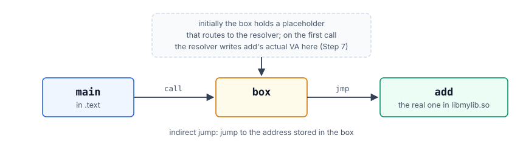
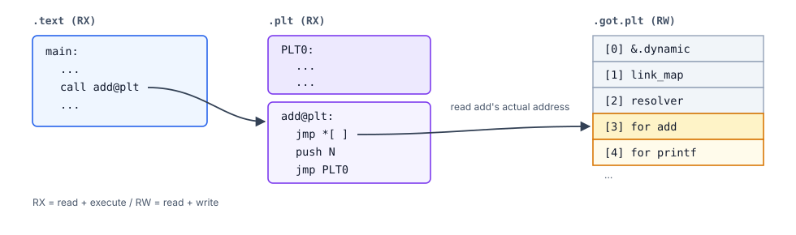
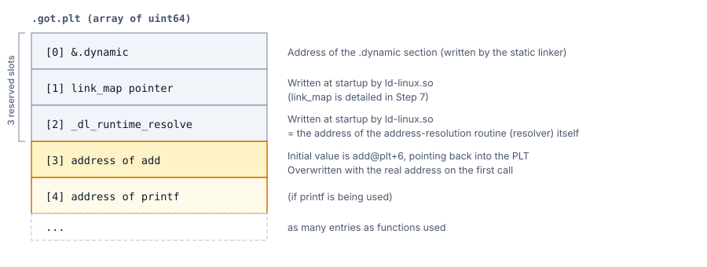
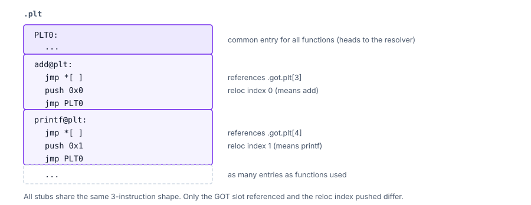

# Step 6. The Static Structure of PLT / GOT

In Step 5, we found that `add`'s runtime VA is `base_libmylib + 0x10f9`.
The problem starts here: **how do we get the `call` instruction inside
`main` to reach that address?**

In this step we look at the **static structure** of the contraptions
that make it work — the **PLT (Procedure Linkage Table)** and the
**GOT (Global Offset Table)**.
(How it works dynamically at runtime is Step 7.)

---

## The problem we want to solve

At the time `main.c`'s `add(2, 3)` is compiled, `add`'s runtime address
is not yet decided. The reasons are as follows:

```
   - add lives in a different .so
   - The base address at which that .so is loaded is different every time (ASLR)
   - Definitions with the same name may exist in multiple shared libraries
```

That is, **"we cannot embed `add`'s actual VA directly into the `call`
instruction"**. So, we instead call, via one level of indirection, an
`add@plt` that can be pinned inside the executable file.

So the strategy we adopt is:

```
   Prepare a single box that will hold the function address.
   Make call an indirect jump that goes through that box.
   The contents of the box will be written at runtime by a routine inside ld-linux.so.
```

Turning this strategy into a picture:



The initial value of the box is a route that ends up at the
**address-resolution routine (resolver)**. The first `call` fires along
this route, and the resolver figures out `add`'s actual VA and writes it
into the box. From the second call onward, it goes through the
rewritten box and jumps directly to `add` (details in Step 7).

This "box" is a **GOT entry (= slot)**, and the small piece of helper
code that calls through that slot is a **PLT entry (= stub)**. From
here on we use the terms **"GOT slot" and "PLT stub"** consistently.

(GOT is the general concept of "an address table for indirect access";
in Linux ELF it is split into 2 sections, `.got` (data or function
pointers subject to eager binding) and `.got.plt` (functions called via
the PLT, lazy binding). Every "GOT slot" this book talks about refers
to an entry in `.got.plt`.)

---

## The big picture



Key points:

- Our subject's `call add@plt` proceeds to the PLT's `add@plt:` entry
- `add@plt`'s jmp *[ ] jumps to the contents of the GOT entry
- The GOT entry is a slot for the true address of `add`
- However, its initial value is the address of the next instruction after jmp *[ ] (the location of push N)
- In other words, the 1st `call add@plt` goes via PLT0: and calls the resolution routine (this is detailed in Step 7)

Notations like `add@plt` are labels that tools such as `objdump -d`
attach to raw addresses for readability; the actual thing is just an
address:

| Notation | Meaning | Value this time |
|---|---|---|
| `add@plt` | The address at which `add`'s PLT stub is placed | `0x1030` |
| `add@plt+6` | The address of the 2nd instruction (`push N`) of the PLT stub | `0x1036` |
| `add@got.plt` | The address of the GOT slot for `add` (the slot labeled "[3] for add" in the figure above) | `0x4000` (`.got.plt[3]`) |

---

## The contents of .got.plt

`.got.plt` is an array of uint64. **The first 3 are reserved**, and the
4th onward is one slot per function:



`[1]` and `[2]` are written by ld-linux.so **after building the link map (below)**.
`[3]` onward is rewritten **when the PLT is resolved** (= **at the first call to the function**).

---

## main's assembly code: call add@plt

At the point `main.c` is compiled, `add`'s actual address is not known
(see § The problem we want to solve). So the compiler emits an object
file containing an **unresolved call to `add` and relocation
information**. Receiving that, the **static linker (binutils ld)**
creates `add@plt` (the PLT stub) and rewrites the `call`'s target to
the address of `add@plt`. As a result, the final `main`'s machine code
becomes `call 0x1030 <add@plt>`. Looking at the `main` function via
`objdump -d main`:

```
0000000000001139 <main>:
    1139:  55                   push   rbp
    113a:  48 89 e5             mov    rbp,rsp
    113d:  be 03 00 00 00       mov    esi,3            ; 2nd arg = 3
    1142:  bf 02 00 00 00       mov    edi,2            ; 1st arg = 2
    1147:  e8 e4 fe ff ff       call   0x1030 <add@plt> ; <-- here!
    114c:  5d                   pop    rbp
    114d:  c3                   ret
```

The target `0x1030` of `call 0x1030` is the address of `add@plt`.
Because `add@plt` is **inside the same ELF file as `main`**, the static
linker can pin its location and write it in as the target of `call`.
So even though `add`'s actual VA is not known until runtime, at link
time the machine code by which `main` calls `add@plt` can be completed.

---

## The assembly code of add@plt

`add@plt` is 1 entry of the PLT stub, 16 bytes / 3 instructions:

```
0000000000001030 <add@plt>:
    1030:  ff 25 ca 2f 00 00    jmp    QWORD PTR [rip+0x2fca]   # 4000 <add@got.plt>
    1036:  68 00 00 00 00       push   0x0
    103b:  e9 e0 ff ff ff       jmp    0x1020 <PLT0>
```

The meaning of the 3 instructions:

- `jmp QWORD [rip+0x2fca]` — `rip` (= address of next instruction
  `0x1036`) + `0x2fca` = `0x4000` is the GOT slot for `add`
  (`add@got.plt` = `.got.plt[3]`).
  It performs an indirect jump to the QWORD value written in that slot.
  At build time, the static linker (binutils ld) writes **`add@plt+6`**
  (= the address `0x1036` of the next instruction `push 0x0`) as the
  **initial value** of this slot. Therefore, when unresolved, this
  indirect `jmp` "falls back" to the next instruction (`push 0x0`).
- `push 0x0` — reloc index (= position within `.rela.plt`). It tells
  the resolver "which relocation to resolve" (see the figure below).
- `jmp 0x1020 <PLT0>` — jumps to PLT0, and after that heads toward the
  address-resolution routine (resolver) (detailed in the next section).

The PLT stubs are lined up one per function in `.plt`. The shape of the
3 instructions is the same for each; what differs per function is only
the GOT slot referenced by `jmp *[ ]` and the value pushed by `push N`
(= the reloc index for that function):



(Our subject's `main` calls only `add`, so in reality there are only 2
entries: PLT0 and add@plt. The printf@plt above is a pattern example of
"what it would look like if there were another function too.")

### Loopback via the initial value

By the initial-value setup above, when unresolved, the 3 instructions
flow in the order "indirect `jmp` → `push 0x0` → `jmp PLT0`", and reach
the resolver via PLT0. What actually happens on the first call with
this structure is traced in Step 7 as **lazy binding**.

---

## The assembly code of PLT0

```
0000000000001020 <PLT0>:
    1020:  ff 35 ca 2f 00 00    push   QWORD PTR [rip+0x2fca]   # 3ff0 (= .got.plt+8 = .got.plt[1])
    1026:  ff 25 cc 2f 00 00    jmp    QWORD PTR [rip+0x2fcc]   # 3ff8 (= .got.plt+16 = .got.plt[2])
    102c:  0f 1f 40 00          nop
```

(Depending on the linker configuration the offsets vary somewhat, but
the GOT slots pointed to do not change.)

```
   1020: push [.got.plt[1]]    ; pass the link_map pointer (link_map is discussed below)
   1026: jmp  [.got.plt[2]]    ; proceed to the resolver (_dl_runtime_resolve) (the resolver's behavior is discussed below)
```

As a result, the resolution routine is called in the form
`_dl_runtime_resolve(link_map, reloc_index)` (`reloc_index` is the `0`
pushed by `add@plt`).

The detailed behavior is in Step 7. What is visible in this chapter is
the structural fact that **PLT0 is the confluence for all function
resolutions**; what happens at that confluence is followed in the next
chapter.

---

## R_X86_64_JUMP_SLOT relocation

So far, we have looked at the contents of `.plt` (PLT stubs) and
`.got.plt` (GOT slots). But even looking only at these two, there are
still questions we cannot answer:

- When the resolver is called from `add@plt`, how does it know **which
  symbol** to resolve?
- How does it know **which GOT slot** to write the resolved actual VA
  into?

The answer lives in `.rela.plt` (= the table pointed to by the
`DT_JMPREL` seen in Step 4).
Each entry lined up here is an **instruction** the static linker
prepared at build time, saying "write the actual VA of this symbol into
this slot", which the resolver reads and processes at runtime.

The format of the instruction is not one-size-fits-all. The ELF spec
defines multiple **relocation types** for different uses, and each
entry records which type it is. The processing side (ld-linux.so or
the resolver) looks at this type and decides "how to rewrite":

| Type | Value | Use |
|---|---|---|
| `R_X86_64_RELATIVE` | 8 | Write `base + r_addend` (Step 3's self-relocation, and main / .so's general relocation) |
| `R_X86_64_GLOB_DAT` | 6 | Data references inside GOT |
| `R_X86_64_JUMP_SLOT` | 7 | Writes to the GOT slot for the PLT ← this section |

The entries in `.rela.plt` are all of type `R_X86_64_JUMP_SLOT`, and
the reloc index pushed by `add@plt` (= 0) is the index that says "look
at the N-th entry in this table".

The structure of one entry:

```c
typedef struct {
    uint64_t r_offset;  // virtual address of the write target (= .got.plt[k])
    uint64_t r_info;    // relocation type + symbol number
    int64_t  r_addend;  // addend (0 for JUMP_SLOT)
} Elf64_Rela;           // 1 entry = 24 bytes
```

The values for the `add` entry:

```
   r_offset = 0x4000                  (= location of .got.plt[3])
   r_info   → sym = 3, type = 7 (= R_X86_64_JUMP_SLOT)
   r_addend = 0
```

`sym = 3` points to `main:.dynsym[3]` that we saw in Step 5 § The
problem we want to solve (which contains the undefined `add` symbol
(UND)).

This entry instructs the resolver to perform the following processing
( **actually executed in Step 7** ):

    *(base_main + r_offset)  =  actual VA of sym (= add)

Substituting concrete values for the subject:

- **Left-hand side** = `base_main + 0x4000` = **actual VA of `.got.plt[3]`** (write destination)
- **Right-hand side** = actual VA of `sym` (= `add`) = **`base_libmylib + 0x10f9`** (value obtained in Step 5)

That is, executing this one entry changes the contents of `.got.plt[3]`
from the initial-value loopback (`add@plt+6`) into the actual address
of the `add` function.

Viewing `add`'s `.rela.plt` entry with `readelf`:

```
$ readelf -r main

Relocation section '.rela.plt' at offset 0x618 contains 1 entry:
  Offset           Info             Type           Sym. Value     Sym. Name + Addend
  0000000000004000 0000000300000007 R_X86_64_JUMP_SLOT 0000000000000000 add + 0
```

This is the instruction "resolve the address of `add` and write it into
`.got.plt[3]` (= `0x4000`)".
For our subject, one `R_X86_64_JUMP_SLOT` relocation corresponds to one
function called via the PLT.

Since `main` this time calls only `add` via the PLT, this unique entry
corresponds to **`.rela.plt[0]`** (= the entry referenced in Step 7 by
the value passed to `_dl_fixup` as `reloc_index = 0`).

---

## Values passed to Step 7

At this point, the correspondences needed for the runtime trace are
established:

```
   call add@plt              -> add@plt (= 0x1030)
   add@plt                   -> GOT[add] (= base_main + 0x4000)
   initial value of GOT[add] -> add@plt+6 (= base_main + 0x1036)
   .rela.plt[0]              -> main:.dynsym[3] add
```

What we confirmed in this chapter is up to these static correspondences.
In the next chapter, we start from `call add@plt` and follow how these
are used at runtime.

---

## What we nailed down this time (points to carry into the next chapter)

```
   [x] A PLT is a 3-instruction stub that goes through a GOT slot
       (= a relay for calling by symbol name)
   [x] The initial value of GOT[add] points to add@plt+6
   [x] The R_X86_64_JUMP_SLOT relocation instructs "what to write into which GOT slot"
       (= the source of information _dl_fixup in Step 7 reads)
```

Next is **Step 7: Reaching the real function via lazy binding** —
starting from an unresolved PLT entry, we dynamically follow the path
from the resolver being called, through the GOT being rewritten,
landing on `add`, and coming back.
