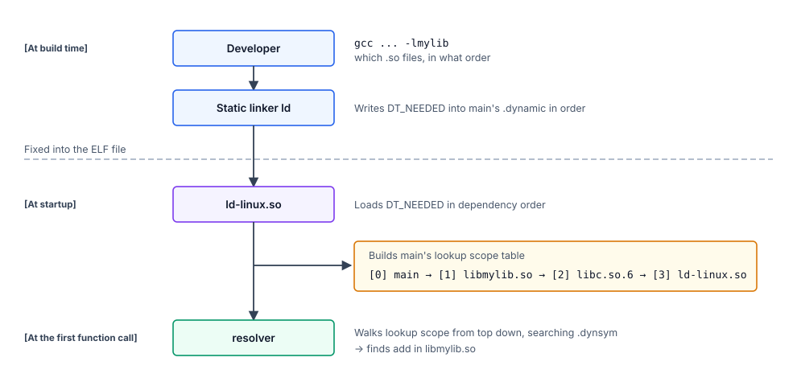

# Appendix D. Library Load Order and Lookup Scope

Where does the order of `main`'s lookup scope (`main → libmylib.so →
libc.so.6 → ld-linux.so`), which we saw in Step 5, actually come from?
In this appendix, we follow the **whole flow** starting from the
developer's link-time specification and ending at the resolver's
runtime search order.

---

## The whole flow



Below, each stage is examined in detail.

---

## Stage 1. The developer's command line

The subject's `build.sh`:

```sh
gcc -o main main.c -L. -lmylib -Wl,-rpath,'$ORIGIN'
```

- `-lmylib` — explicit specification to link `libmylib.so`
- gcc's driver **implicitly adds `-lc`** (unless `-nostdlib` and friends are given)

That is, the command line the static linker (`binutils ld`) actually
receives is effectively:

```
ld ... -lmylib -lc ...
```

in this order.

---

## Stage 2. The static linker writes DT_NEEDED

The static linker processes the **`-l` options on the command line from
left to right**, and writes the corresponding `DT_NEEDED` entries into
`main`'s `.dynamic`.

Because `-lmylib` came first and `-lc` came after:

```
main's .dynamic (excerpt):
   DT_NEEDED = libmylib.so   ← from -lmylib
   DT_NEEDED = libc.so.6     ← from the implicit -lc
```

As seen in the raw-byte dump in Step 4, they are lined up in this order
when written. At this point, **the order is fixed in the ELF file**
(and never rewritten thereafter).

---

## Stage 3. ld-linux.so loads dependencies in order

At startup, `ld-linux.so` walks `DT_NEEDED` following the procedure
seen in Step 4, and loads dependent libraries **in dependency order**
(precisely, **breadth-first (BFS)**):

1. Take `DT_NEEDED` entries from main's `.dynamic` from the head in order
2. Load them in order (if already loaded, skip)
3. Walk the loaded set from the top, and further pick up each `.so`'s
   `DT_NEEDED` and add them
4. Repeat until all dependencies are resolved

Tracing on the subject:

- **Round 1**: process main's `DT_NEEDED` in order
  - mmap `libmylib.so`
  - mmap `libc.so.6`
- **Round 2**: process each `.so`'s `DT_NEEDED` in the order they were added
  - libmylib.so's `DT_NEEDED`: `libc.so.6` (already present, skip)
  - libc.so.6's `DT_NEEDED`: `ld-linux.so` (special case, already loaded)

**Final link_map / lookup scope order**: `main → libmylib.so → libc.so.6 → ld-linux.so`
(This order is the link_map link order, not the physical order of `mmap`. `ld-linux.so`, as covered in Step 2, was mapped first)

---

## Stage 4. The lookup scope table is built

`ld-linux.so` builds **main's lookup scope table** in Stage 3's load
order (the table on the right of Step 7 § `link_map`):

```
main's lookup scope (= the table pointed to by main's link_map's l_scope):
   [0] main             ← 1st in load order
   [1] libmylib.so      ← 2nd in load order
   [2] libc.so.6        ← 3rd in load order
   [3] ld-linux.so      ← 4th in load order
```

That is, **`lookup scope`'s substance is a table with `link_map`
pointers lined up in load order**. In this book's subject, this order
matches the order of the `link_map` linked list (Step 7).

---

## Stage 5. The resolver searches in this order

As we traced in Step 7, at runtime the resolver walks the above table
from `main`'s link_map's `l_scope` and searches each ELF's `.dynsym`
**from top down**:

- [0] main → only UND (undefined) `add`, skip
- [1] libmylib.so → `add` found! → returns the actual VA `base_libmylib + 0x10f9`

With that, `add`'s actual VA is obtained (Step 5 symbol resolution).

---

## Summary

**The order of `-l` specified by the developer** is baked in statically
as the order of `.dynamic`'s `DT_NEEDED`, and propagates as-is through
the runtime load order, the order of lookup scope, and finally the
search order.

"Which library's symbol takes precedence" is **decided at link time on
the command line** — this is also why dynamic linking's search order is
already decided "long before execution".

---

## Related chapters

- **Step 4 § Following DT_NEEDED** — contents of `.dynamic` and raw bytes of DT_NEEDED
- **Step 5 § lookup scope** — the concept of lookup scope and its order in the subject
- **Step 7 § What is link_map** — link_map and l_scope, the resolver at runtime
