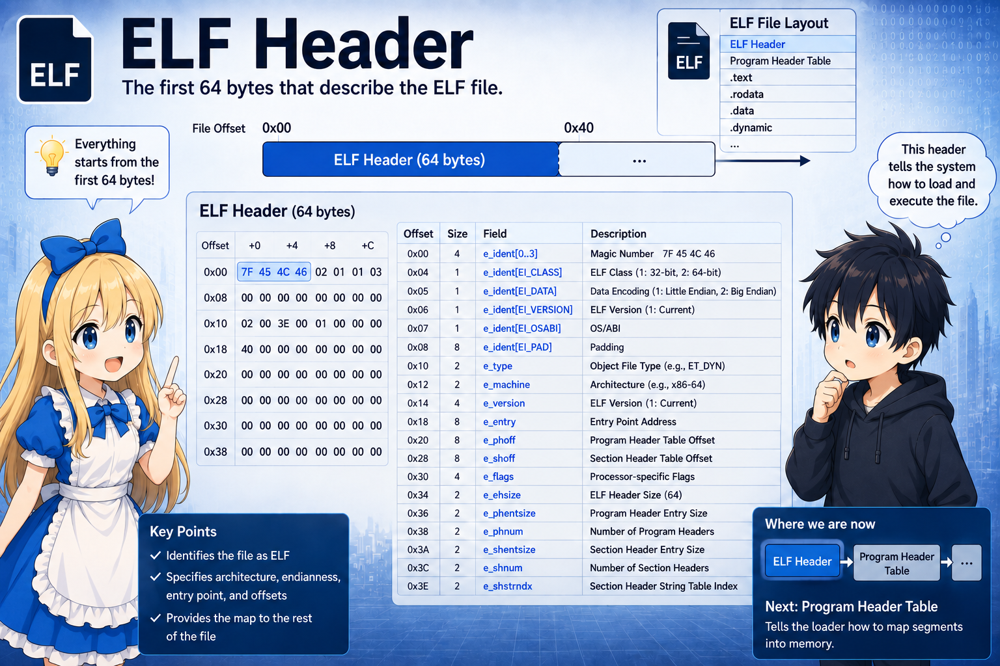
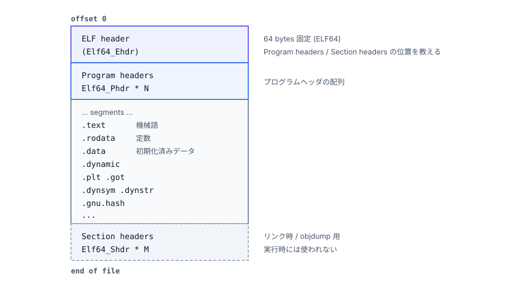
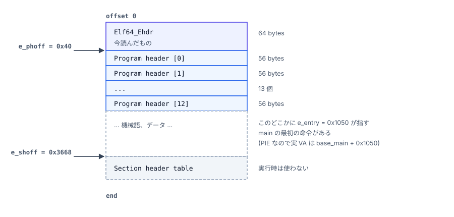

# Step 1. ELFヘッダ

## ELFファイルとは

ELF (Executable and Linkable Format) は Linux/Unix 系で使われる
オブジェクトファイル形式。実行ファイルも、共有ライブラリ (`.so`) も、
オブジェクトファイル (`.o`) も、全て ELFファイル。

題材の実行ファイル `main` も動的ライブラリ `libmylib.so` も ELF。

---

## ELFファイル全体の構造

ファイルの先頭から順に並んでいるイメージ:



つまり ELF ファイルは **「先頭の64バイトが ELF header であり、ELF header の内容を元に、ファイル全体を解読できる」** ようになっている 。

---

## ELFヘッダの構造 (Elf64_Ehdr)

ELF ヘッダは `Elf64_Ehdr` という 64 バイトの構造体。
C で書くとこうなる (`/usr/include/elf.h` に定義あり):

```c
typedef struct {
    unsigned char e_ident[16];   // [ 0..15] マジック等
    uint16_t      e_type;        // [16..17] ファイル種別
    uint16_t      e_machine;     // [18..19] CPU種別
    uint32_t      e_version;     // [20..23] = 1
    uint64_t      e_entry;       // [24..31] エントリポイント
    uint64_t      e_phoff;       // [32..39] Program header table の file offset
    uint64_t      e_shoff;       // [40..47] Section header table の file offset
    uint32_t      e_flags;       // [48..51] CPU依存フラグ
    uint16_t      e_ehsize;      // [52..53] このヘッダ自身のサイズ (=64)
    uint16_t      e_phentsize;   // [54..55] Program header 1 個のサイズ (=56)
    uint16_t      e_phnum;       // [56..57] Program header の個数
    uint16_t      e_shentsize;   // [58..59] Section header 1 個のサイズ (=64)
    uint16_t      e_shnum;       // [60..61] Section header の個数
    uint16_t      e_shstrndx;    // [62..63] section名表のインデックス
} Elf64_Ehdr;                    // 合計 64 バイト
```

本シリーズで触れるのは以下の 5 つの構造体メンバー。

### `e_type` — ファイルの種別

```
   ET_REL  = 1   再配置可能ファイル (.o)
   ET_EXEC = 2   実行ファイル (固定アドレス)
   ET_DYN  = 3   共有ライブラリ / PIE 実行ファイル
```

本シリーズは **PIE** なので、
`./main` も `libmylib.so` もどちらも `ET_DYN`。

**PIE** (Position-Independent Executable, 位置独立実行ファイル) は、
共有ライブラリ (`.so`) と同じ仕組みでロードする実行ファイル。ELF 内の
アドレス値はすべて「`base = 0` を仮定して書かれたオフセット」で、
起動時に決まる base を足したものが実 VA (Virtual Address:仮想アドレス)になる:

```
実 VA（Virtual Address) = base + (ELF 内のアドレス値)
```

`./main` がロードされた base アドレスを本シリーズでは `base_main` と書く
(他の ELF の base ラベル、ASLR との関係は [付録 A 用語と表記の規約](./08_notation.md))。

### `e_entry` — プログラム開始位置 (メモリ上の番地)

`e_entry` はプログラムの開始位置。
`e_phoff` などのファイル内オフセットと違い、メモリ上の番地。上の「base + ELF 内のアドレス値」のルールが適用され、実 VA は
`base_main + e_entry` (詳細は Step 2)。

### `e_phoff` / `e_phentsize` / `e_phnum` — Program header 表の所在

```
   e_phoff       プログラムヘッダ配列の先頭が「ファイル先頭から何バイト目」か   (= 開始位置)
   e_phentsize   プログラムヘッダ配列のエントリ 1 個が「何バイト」か           (= 刻み幅)
   e_phnum       エントリが「何個」並んでいるか              (= 個数)
```

ELF を読む側 (起動時はカーネル、後の章では `ld-linux.so` も) はこの 3 つ
を使って `[e_phoff, e_phoff + e_phentsize*e_phnum)` の範囲を Program
header 配列として読み出す。カーネルはファイル上の `e_phoff` から直接
読み、`ld-linux.so` はメモリ上に既にマップされた領域と auxv の
`AT_PHDR` などから位置を得る (詳細は Step 2 / Step 3)。

---

## 実バイナリで見る (hexdump)

`hexdump -C main | head -4` の出力例:

> 注: gcc バージョンや最適化オプションで値は多少変わる。
> 以下は典型的な PIE 実行ファイルのバイト並び。

```
Offset    Bytes                                            ASCII
--------  -----------------------------------------------  ----------------
00000000  7f 45 4c 46 02 01 01 00 00 00 00 00 00 00 00 00  .ELF............
00000010  03 00 3e 00 01 00 00 00 50 10 00 00 00 00 00 00  ..>.....P.......
00000020  40 00 00 00 00 00 00 00 68 36 00 00 00 00 00 00  @.......h6......
00000030  00 00 00 00 40 00 38 00 0d 00 40 00 1f 00 1e 00  ....@.8...@.....
```

このバイト列を、上の構造体に当てはめる:

```
オフセット   バイト                    意味
----------   ----------------------    ----------------------------------------
[ 0.. 3]    7f 45 4c 46               マジック ".ELF"
[ 4]        02                        EI_CLASS    = 2  -> ELF64
[ 5]        01                        EI_DATA     = 1  -> little endian
[ 6]        01                        EI_VERSION  = 1
[ 7]        00                        EI_OSABI    = 0  -> System V
[ 8]        00                        EI_ABIVERSION = 0
[ 9..15]    00 00 00 00 00 00 00      パディング
                                      ----- ここまで e_ident[16] -----
[16..17]    03 00                     e_type      = 3        -> ET_DYN
[18..19]    3e 00                     e_machine   = 0x3e=62  -> EM_X86_64
[20..23]    01 00 00 00               e_version   = 1
[24..31]    50 10 00 00 00 00 00 00   e_entry     = 0x1050
[32..39]    40 00 00 00 00 00 00 00   e_phoff     = 0x40   (= 64バイト目)
[40..47]    68 36 00 00 00 00 00 00   e_shoff     = 0x3668
[48..51]    00 00 00 00               e_flags     = 0
[52..53]    40 00                     e_ehsize    = 0x40 = 64
[54..55]    38 00                     e_phentsize = 0x38 = 56
[56..57]    0d 00                     e_phnum     = 13
[58..59]    40 00                     e_shentsize = 0x40 = 64
[60..61]    1f 00                     e_shnum     = 31
[62..63]    1e 00                     e_shstrndx  = 30
```

リトルエンディアンなので、複数バイト数値は逆順で読むことに注意:

```
   バイト並び:    50 10 00 00 00 00 00 00
                  ^^ ^^ ^^ ^^ ^^ ^^ ^^ ^^
                  低い桁              高い桁
   数値として:    0x0000000000001050   ->   0x1050
```

---

## ELFヘッダから読み取れるファイル構造



ポイント:

- `e_phoff = 0x40` で、ELFヘッダのすぐ後ろから Program header が始まる
- `e_phentsize = 56` × `e_phnum = 13` = `728` バイトが Program header table 全体

---

## readelf -h main で見る

先ほどの hexdump と同じ内容を `readelf` がデコードして表示すると:

```
$ readelf -h main
ELF Header:
  Magic:   7f 45 4c 46 02 01 01 00 00 00 00 00 00 00 00 00
  Class:                             ELF64
  Data:                              2's complement, little endian
  Version:                           1 (current)
  OS/ABI:                            UNIX - System V
  ABI Version:                       0
  Type:                              DYN (Position-Independent Executable file)
  Machine:                           Advanced Micro Devices X86-64
  Version:                           0x1
  Entry point address:               0x1050
  Start of program headers:          64 (bytes into file)
  Start of section headers:          13928 (bytes into file)
  Flags:                             0x0
  Size of this header:               64 (bytes)
  Size of program headers:           56 (bytes)
  Number of program headers:         13
  Size of section headers:           64 (bytes)
  Number of section headers:         31
  Section header string table index: 30
```

hexdump で見たバイトと完全に対応している。
左の数字 (オフセット) と右の表示が頭の中で一致するようになるのが目標。

---

## 今回押さえたこと (次章へ持ち越す要点)

```
   [x] e_entry はメモリ上の番地 (実 VA = base_main + e_entry)
   [x] e_phoff / e_phentsize / e_phnum で Program header 配列を辿れる
       (= 次章 Step 2 の入口)
   [x] 本シリーズは PIE (ET_DYN) 前提
```

次は **Step 2: Program header** — ここで「メモリにどう配置されるか」が決まる。
