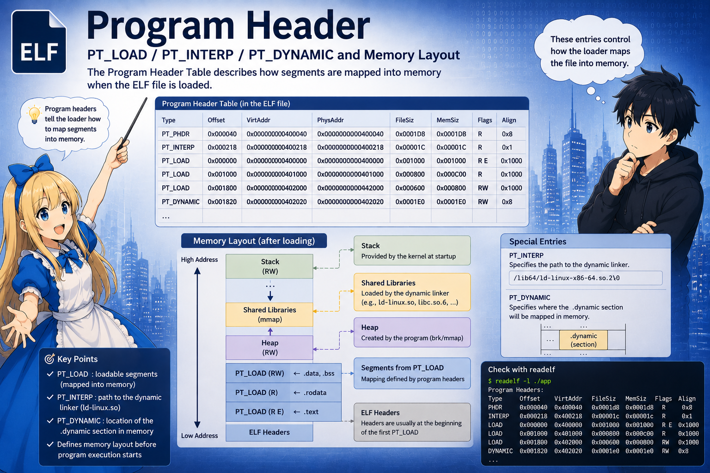

# Step 2. プログラムヘッダ

ELFヘッダの次はプログラムヘッダ。本章はプログラムヘッダの構造 (`Elf64_Phdr`) を読む。


---

## ファイル全体図

```
   offset 0
       +------------------------+
       |  Elf64_Ehdr (64B)      |
       +------------------------+ <-- e_phoff
       |  Elf64_Phdr [0]        | \
       |  Elf64_Phdr [1]        |  |
       |  ...                   |  > 13 個 (e_phnum)、各 56B (e_phentsize)
       |  Elf64_Phdr [12]       | /
       +------------------------+
       |                        |
       |  実体データ              |
       |  .text, .rodata, .data,|
       |  .dynamic, .plt, .got, |
       |  .dynsym, .dynstr,     |
       |  .gnu.hash, ...        |
       |                        |
       +------------------------+
       |  Section headers       |
       +------------------------+
   end
```

プログラムヘッダは 1 つ 56 バイトの構造体 (`Elf64_Phdr`) で、
**メモリにロードされる領域** または **実行環境 (カーネル / 動的リンカ)
に情報を伝える領域** を 1 つ表す。前者を **セグメント** と呼ぶ。
プログラムヘッダは題材では 13 個あるが、そのうち実際にメモリにロード
される `PT_LOAD` は 4 個。残りは `PT_INTERP` (動的リンカのパス) /
`PT_DYNAMIC` (`.dynamic` の位置) など、それぞれ別の役割を持つ。

セグメントの中には `.text` などの **セクション** が入る
(セグメント ≠ セクション; 1 セグメントに複数セクションが束ねて入る)。

---

## Elf64_Phdr の構造

Program header の 1 エントリは `Elf64_Phdr` という 56 バイトの構造体。
C で書くとこうなる (`/usr/include/elf.h` に定義あり):

```c
typedef struct {
    uint32_t p_type;     // [ 0.. 3] セグメントの種別
    uint32_t p_flags;    // [ 4.. 7] アクセス権 (R/W/X)
    uint64_t p_offset;   // [ 8..15] ファイル内オフセット (どこから)
    uint64_t p_vaddr;    // [16..23] 仮想アドレス (どこへ置く)
    uint64_t p_paddr;    // [24..31] 物理アドレス
    uint64_t p_filesz;   // [32..39] ファイル上のサイズ
    uint64_t p_memsz;    // [40..47] メモリ上のサイズ (>= p_filesz)
    uint64_t p_align;    // [48..55] アライメント (題材では 0x1000)
} Elf64_Phdr;            // 合計 56 バイト
```

本シリーズで触る構造体メンバーを、目的別に下にまとめる。

### `p_type` — セグメントの種別

無数にある中で、毎回必ず登場する p_type は 4 つ。`= 数値` は ELF 仕様
で決められた型 ID :

```
   PT_LOAD     (= 1)   メモリへ配置する範囲と保護属性を示す
                       (題材では 4 個)
   PT_DYNAMIC  (= 2)   このセグメントの中に .dynamic セクションがある
                       (Step 4 で使う)
   PT_INTERP   (= 3)   このセグメントの中身は動的リンカのパス文字列
                       (= "/lib64/ld-linux-x86-64.so.2")
   PT_PHDR     (= 6)   このセグメント自体が「プログラムヘッダ表」を指す
```

### `p_offset` / `p_vaddr` — アドレス関連

- `p_offset` — ファイル先頭からのオフセット (バイト数)
- `p_vaddr` — メモリ上の番地

`p_vaddr` は 01 章で見た「ELF 内のアドレス値」なので、実 VA は
`base_main + p_vaddr`。例えば `.text` が属するプログラムヘッダの
`p_vaddr` は `0x1000` で、ある実行で `base_main = 0x5555_5555_4000`
なら、このセグメントの実先頭は `0x5555_5555_5000`。次に起動すると
`base_main` が変わるのでセグメントの番地も変わる。

### `p_filesz` / `p_memsz` — サイズ関連

- `p_filesz` — ファイルから読むバイト数
- `p_memsz` — メモリ上で確保するバイト数 (`p_memsz >= p_filesz`)

`p_memsz > p_filesz` の差分はファイルに存在しない領域で、カーネルが
ゼロで初期化する (= `.bss` などのゼロ初期化領域)。題材では
`.data` / `.bss` を含む PT_LOAD で 8 バイトが該当 (具体例は後段の
PT_LOAD セクション)。

### `p_flags` — R/W/X

ページの保護属性。`.text` は `R-X`、`.rodata` は `R--`、`.data` /
`.bss` は `RW-` というように、セグメントごとに最小限の権限が設定される。

### `p_paddr` / `p_align`

`p_paddr` は物理アドレス。Linux のユーザープロセスでは使わない
(題材では `p_vaddr` と同じ値だが、常に同値とは限らない)。
`p_align` はアライメント。題材では `0x1000` (= 4KB ページ)。

---

## readelf -l main の出力

```
$ readelf -l main

Elf file type is DYN (Position-Independent Executable file)
Entry point 0x1050
There are 13 program headers, starting at offset 64

Program Headers:
  Type           Offset             VirtAddr           PhysAddr
                 FileSiz            MemSiz              Flags  Align
  PHDR           0x0000000000000040 0x0000000000000040 0x0000000000000040
                 0x00000000000002d8 0x00000000000002d8  R      0x8
  INTERP         0x0000000000000318 0x0000000000000318 0x0000000000000318
                 0x000000000000001c 0x000000000000001c  R      0x1
      [Requesting program interpreter: /lib64/ld-linux-x86-64.so.2]
  LOAD           0x0000000000000000 0x0000000000000000 0x0000000000000000
                 0x0000000000000630 0x0000000000000630  R      0x1000
  LOAD           0x0000000000001000 0x0000000000001000 0x0000000000001000
                 0x0000000000000159 0x0000000000000159  R E    0x1000
  LOAD           0x0000000000002000 0x0000000000002000 0x0000000000002000
                 0x00000000000000dc 0x00000000000000dc  R      0x1000
  LOAD           0x0000000000002da0 0x0000000000003da0 0x0000000000003da0
                 0x0000000000000278 0x0000000000000280  RW     0x1000
  DYNAMIC        0x0000000000002db0 0x0000000000003db0 0x0000000000003db0
                 0x0000000000000210 0x0000000000000210  RW     0x8
  NOTE           ...
  GNU_PROPERTY   ...
  GNU_EH_FRAME   ...
  GNU_STACK      ...
  GNU_RELRO      ...
```

注目するのは4種類の p_type:

```
   PHDR        オフセット 0x40, サイズ 0x2d8  (0x2d8 = 13 * 56 = 728)
                 -> e_phoff / e_phnum と一致

   INTERP      文字列 "/lib64/ld-linux-x86-64.so.2"  (28 bytes)
                 -> Step 3 で使う

   LOAD x 4    後述 (題材では LOAD が4つある)

   DYNAMIC     仮想アドレス 0x3db0, サイズ 0x210
                 -> Step 4 で使う
```

---

## PT_LOAD — メモリへの貼り付け

`PT_LOAD` だけ4つ並べてみる:

```
   #   p_type  p_offset    p_vaddr     p_filesz   p_memsz    flags
   --  ------  ----------  ----------  ---------  ---------  -----
   1   LOAD    0x0000      0x0000      0x0630     0x0630     R
   2   LOAD    0x1000      0x1000      0x0159     0x0159     R E       <-- .text
   3   LOAD    0x2000      0x2000      0x00dc     0x00dc     R         <-- .rodata
   4   LOAD    0x2da0      0x3da0      0x0278     0x0280     RW        <-- .data/.bss
```

これを図にすると (ファイル上の 4 つの `PT_LOAD` が、カーネルの `mmap`
で仮想アドレス空間に配置される様子):

```
   FILE (on disk)                       MEMORY (after mmap by kernel)
   ==============                       =============================

   offset 0x0000                        vaddr 0x0000 + base_main
       +-----------------+                  +-----------------+
       | ELF header      |                  | ELF header etc. |
       | Program headers | ---LOAD#1--->    | (R only)        |
       | INTERP string   |                  |                 |
       | .note ...       |                  |                 |
       +-----------------+                  +-----------------+
   offset 0x1000                        vaddr 0x1000 + base_main
       +-----------------+                  +-----------------+
       | .plt            |                  | .plt            |
       | .text (code)    | ---LOAD#2--->    | .text           |  R-X
       |  (add@plt ...)  |                  |  (add@plt ...)  |
       +-----------------+                  +-----------------+
   offset 0x2000                        vaddr 0x2000 + base_main
       +-----------------+                  +-----------------+
       | .rodata         | ---LOAD#3--->    | .rodata         |  R--
       | .eh_frame       |                  |                 |
       +-----------------+                  +-----------------+
   offset 0x2da0                        vaddr 0x3da0 + base_main
       +-----------------+                  +-----------------+
       | .init_array     |                  | .init_array     |
       | .dynamic        | ---LOAD#4--->    | .dynamic        |  RW-
       | .got  .got.plt  |                  | .got  .got.plt  |
       | .data           |                  | .data           |
       |                 |                  | .bss   (zero)   | <-- p_memsz is
       +-----------------+                  +-----------------+     8 bytes larger
```

LOAD#4 だけ `p_offset (0x2da0)` と `p_vaddr (0x3da0)` が **ズレている**。
「ファイル上は前のセグメントにくっつけて詰めて置くが、メモリ上では新しい
ページ境界 (0x3000 のさらに先) に置きたい」という指示。

LOAD#4 は `p_memsz (0x280) > p_filesz (0x278)` で、差の 8 バイトが
`.bss` としてカーネルがゼロ初期化する。


---

## PT_INTERP — 動的リンカのパス

PT_INTERP の中身は **文字列だけ**。`p_offset = 0x318`, `p_filesz = 0x1c
(= 28 bytes)` を読むと:

```
   2f 6c 69 62 36 34 2f 6c 64 2d 6c 69 6e 75 78 2d
   78 38 36 2d 36 34 2e 73 6f 2e 32 00

   /  l  i  b  6  4  /  l  d  -  l  i  n  u  x  -
   x  8  6  -  6  4  .  s  o  .  2  \0
```

カーネルはこの文字列を読んで `/lib64/ld-linux-x86-64.so.2` を実行する。
この PT_INTERP で指定された動的リンカが、 **./main に必要な動的リンク処理を担当する** 。

### 動的リンカ自体も ELF ファイル

PT_INTERP が指す `/lib64/ld-linux-x86-64.so.2` も **ELF ファイル** (`Type: DYN`)。中身は機械語であって、
特殊なフォーマットではない。
(以降この文書では `ld-linux.so` と省略して呼ぶことがあるが、すべて
このファイルを指す。)

カーネルから見ると、ロード処理は:

- main を読み込む       → ELF ヘッダ読む → Program header 読む → PT_LOAD を mmap
- ld-linux.so を読み込む → **全く同じ処理** をもう一度繰り返すだけ

ld-linux.so も `ET_DYN` なので、カーネルが main とは別の番地にマップ
する。この先頭を **`base_ld`** と書く (`base_main` とは別の番地で、
同じプロセスの仮想アドレス空間に共存する)。

### カーネルから動的リンカへの制御権

カーネルが ld-linux.so のマップを終えた後、制御は ld-linux.so の
`e_entry` に渡る。main の `e_entry` には **まだジャンプしない**。
動的リンカが諸々準備した上で、最後に main の `e_entry` にジャンプ
する ── という流れ (詳細は Step 3)。

なぜ main を直接呼ばないのか: main は `libmylib.so` / `libc.so.6` に
依存していて、それらをロードしないと `call add@plt` という add()関数の呼び出しが失敗する。
それを準備するのが `ld-linux.so` の仕事で、`ld-linux.so` 自体は他の
ELF に依存しないため、`ld-linux.so` だけ先に独立して走れる。

---

## PT_DYNAMIC — .dynamic への案内

動的リンクに必要なメタデータ一式は `.dynamic` セクションに入っている。
`.dynamic` は `DT_NEEDED` / `DT_SYMTAB` / `DT_STRTAB` など、頭が `DT_`
で始まるエントリが並ぶテーブル (中身の詳細は Step 4 で読む)。

そしてプログラムヘッダの PT_DYNAMIC は **「その `.dynamic` がメモリのどこにあるか」を
指している**。PT_DYNAMIC 自体にメタデータは入っておらず、`.dynamic`
本体の所在 (p_vaddr) と大きさ (p_filesz) を伝えるだけ。動的リンカは
これを辿って `.dynamic` に到達し、そこから動的リンクの一連の作業を
始める。

```
   p_type   = PT_DYNAMIC
   p_offset = 0x2db0        <-- ファイル上の場所
   p_vaddr  = 0x3db0        <-- 実行時のメモリ番地
   p_filesz = 0x210         <-- 16 bytes * N entries
```


---

## カーネルの仕事と現時点のメモリ

`./main` を実行した直後にカーネルがやることをまとめると:

```
   1. ELF ヘッダを読む                                  (Step 1 で詳述)
   2. Program header を読む                             (Step 2 = 本章)
        - 各 PT_LOAD を mmap → main を VA 空間に配置 (base_main)
        - PT_INTERP の ld-linux.so も同様にロード (base_ld)
   3. ld-linux.so の e_entry にジャンプ                 (→ Step 3 へ)
```

ここまでがカーネルの担当。以降は ld-linux.so が動く。この時点での
VA 空間はこういう状態:

```
   仮想アドレス空間 (例)

       低位 +-------------------------+
            |                         |
            | (空き)                  |
            |                         |
   base_main+-------------------------+ <-- ASLR で決まる
            | main: LOAD#1 R--        |
            +-------------------------+
            | main: LOAD#2 R-X .text  |
            +-------------------------+
            | main: LOAD#3 R-- .rodata|
            +-------------------------+
            | main: LOAD#4 RW- .got   |
            |              .data .bss |
            +-------------------------+
            |                         |
            | (空き)                  |
            |                         |
   base_ld  +-------------------------+ <-- これも ASLR で決まる
            | ld-linux.so: LOAD#1 R-X |
            +-------------------------+
            | ld-linux.so: LOAD#2 RW- |
            +-------------------------+
            |                         |
            :                         :
       高位
```

---

## 今回押さえたこと (次章へ持ち越す要点)

```
   [x] PIE なので 実 VA = base + p_vaddr (main と ld-linux.so で base が独立)
   [x] PT_LOAD に従って各セグメントがメモリにマップされる
       (p_memsz > p_filesz の差分は .bss としてゼロ初期化)
   [x] PT_INTERP が指す ld-linux.so にカーネルは制御を渡す (= Step 3 へ)
   [x] PT_DYNAMIC が .dynamic の場所を伝える (= Step 4 で読む)
```

次は **Step 3: 動的リンカの起動** —
`ld-linux.so の e_entry にジャンプした` 直後から始まり、
`main の e_entry` に着地するまでを追う。
