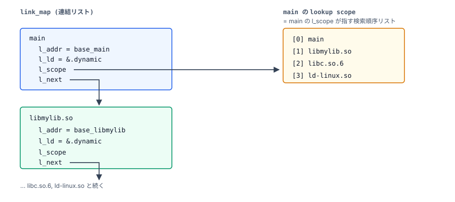
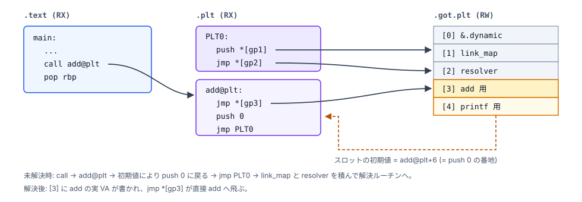

# Step 7. 遅延束縛で実関数に到達する

Step 6 で **`add` の実 VA が `.got.plt[3]` にまだ書き込まれていない
状態** (= 「未解決状態」) の静的構造が出来上がった。このステップでは、
`main` が初めて `add(2, 3)` を呼ぶ時に resolver が行う **遅延束縛
(lazy binding)** を追いかける。

そして 2 回目以降の呼び出しで、`add` のアドレス解決処理が省略されることを確認する。

---

## 出発点

Step 6 から引き継ぐ値は次の 4 つ (すべて `main` の image 内オフセット;
実 VA は `base_main + 各値`):

```
   add@plt              = 0x1030
   PLT0                 = 0x1020
   .got.plt[3] の位置    = 0x4000
   .got.plt[3] の初期値  = 0x1036 (= add@plt+6)
```

ここからは `call add@plt` の初回実行を追う。

---

## 解決処理に使う情報

命令列を追う前に、`link_map` と `_dl_runtime_resolve` の役割を確認する。

### `link_map` とは何か

ld-linux.so が **内部で持つ連結リスト** のデータ構造。ロードされた
各 ELF (main / libmylib.so / libc.so.6 / ld-linux.so 自身) ごとに
**link_map ノード** を 1 つ持つ。各 link_map ノード (`struct link_map`)
の主なメンバー:

- `l_addr` — ロードされた base アドレス
- `l_ld` — その ELF の `.dynamic` の位置
- `l_next` / `l_prev` — 隣の link_map ノードへのポインタ
- (他にシンボル表・再配置表のキャッシュなど)

resolver は「**どの ELF の依頼か**」を知らないと動作できないので、
PLT0 はこの link_map ノードのアドレスを resolver に渡す。
`.got.plt[1]` に入っているのが、その link_map ノードのアドレス
(Step 6 で見た「ld-linux.so が起動時に埋める」スロットの 1 つ目)。

図にすると、link_map の連結リスト (左) と、main の `l_scope` が指す
lookup scope の表 (右) は次のような関係:



(右の表が **Step 5 § lookup scope で触れた「シンボル検索の順序リスト」
の実体** で、`link_map` の `l_scope` フィールドがまさにこの表を指す
ポインタ。)

`.got.plt[1]` に入っているのは、この先頭 (`main` の) link_map ノード
へのポインタ。resolver はここから `l_scope` を経由して右の表を参照し、
上から順に各 ELF の `.dynsym` を検索する (本書の題材 (単純な静的依存)
では、この表の順序は左の連結リスト順とほぼ一致する)。

### `_dl_runtime_resolve` はどこにあるか

**ld-linux.so の中の関数**であり、main、libmylib.so、libc.so.6
には存在しない。ld-linux.so が起動時にその関数のアドレスを `main` の
`.got.plt[2]` に書き込んでおく (Step 6 で見た「ld-linux.so が起動時
に埋める」スロットの 2 つ目)。だからこそ Step 6 で見た PLT0 の 2 命令目
`jmp [.got.plt[2]]` がこの `_dl_runtime_resolve` を起動できる
(Step 6 の § PLT0 のアセンブリコード を参照)。

## add 初回呼び出しの詳細

`main` の中の `call 0x1030 <add@plt>` から始めて、
`add` の機械語に着地するまでを、CPU が実行する命令の順に並べる。

追いかける先の PLT/GOT (Step 6 の 全体図 を、PLT0 の中身と `push 0`
を反映した形で再掲):



(gp1 / gp2 / gp3 は `.got.plt[1]` / `[2]` / `[3]` の略記)

```
   時刻  実行する命令                       何が起きるか
   ----  ------------------------------  -----------------------------------
   T0    main: call add@plt              戻りアドレス (= call の下の命令 pop rbp の番地 0x114c) を
                                          push、PC <- 0x1030 (= add@plt)

   T1    add@plt: jmp [rip+0x2fca]       rip (= 次命令 (push 0) の 0x1036) + 0x2fca = 0x4000
                                          = .got.plt[3] のアドレス
                                          (スロットの実 VA = base_main + 0x4000)
                                          スロットの中身 = base_main + 0x1036 (= add@plt+6 の実 VA)
                                          PC <- base_main + 0x1036
                                          (= add@plt+6、loopback で下の命令 push 0 の場所へ)

   T2    add@plt+6: push 0               スタックに reloc index = 0 を積む

   T3    add@plt+11: jmp 0x1020          PC <- PLT0 (0x1020)

   T4    PLT0: push [rip+0x2fca]         [.got.plt[1]] = link_map を push

   T5    PLT0+6: jmp [rip+0x2fcc]        [.got.plt[2]] = _dl_runtime_resolve
                                          PC <- ld-linux.so 内の解決ルーチン

   T6    _dl_runtime_resolve             add の引数を保持するためレジスタを退避
                                          (まだアセンブリの世界)
   T7    ↓
   T8    _dl_fixup を呼ぶ                **ここで初めて C の世界**
                                          (_dl_fixup は elf/dl-runtime.c の C 関数)
   T9    ↓
   T10   add の本物アドレスを求める      (= Step 5 の手順)
   T11   .got.plt[3] に書き込む
   T12   _dl_runtime_resolve             T6 で退避したレジスタを復元、
                                          add の実 VA へ jmp して抜ける
                                          PC <- base_libmylib + 0x10f9

   T13   add: ...                        add 関数の機械語が走る
   T14   ↓
   T15   ret                              PC <- main の次の命令
                                          (T0 で push した戻りアドレス)

   T16   main: pop rbp                   main の続き (T0 の戻りアドレス 0x114c)
```

T0〜T5 が "PLT 経由の前置き"、
T6〜T11 が "解決ルーチンの仕事"、
T12〜T15 が "実関数の実行"。

---

## スタックの状態

T6 の時点 (resolver に入った直後) のスタックは:


resolver 入口の状態:

- **スタック**: PLT が積んだ `link_map` と `reloc_index = 0` (上図参照)
- **RDI / RSI**: 本来の呼び出し先 `add(2, 3)` の引数 (`edi = 2`,
  `esi = 3`) が入ったまま。壊すと `add(2, 3)` が呼べなくなる

そのため `_dl_runtime_resolve` (手書きアセンブリ) はまず **caller-saved
レジスタ群** (関数呼び出しで引数や一時値を運ぶ側、`RDI` / `RSI` もこれに
含まれる) を退避し、次にスタック上の `link_map` / `reloc_index` を
取り出して C 関数 `_dl_fixup(link_map, reloc_index)` を呼ぶ (このとき
System V x86_64 ABI に従って、第 1 引数を `RDI` に、第 2 引数を `RSI`
に載せる)。

---

ここでの要点は 2 つ:

1. **`_dl_fixup` の戻り値 = `add` の実 VA** (= `base_libmylib + 0x10f9`)。
2. **resolver は `add` に `call` ではなく `jmp` で飛ぶ** (T12)。だから
   add の末尾の `ret` は main の `pop rbp` に直接戻れる (下図参照)。

resolver が add に jmp する直前 (= add が呼ばれた瞬間) のスタック:


add に入った時点でスタック先頭が **main の戻り先** なので、add の末尾の
`ret` はそれを pop してそのまま main の `pop rbp` に戻る。

以降、これらの内訳 — `_dl_fixup` の中身、`.got.plt[3]` に書き込む値、
`add` の実行と `main` への帰還 — を順に詳しく見ていく。

---

## _dl_fixup の中身

Step 4〜6 の材料 (`.dynamic` / `.dynsym` / `.dynstr` / `.rela.plt`) を
組み合わせて `add` の実 VA を求め、`.got.plt[3]` に書き込むだけで、
新しい仕組みは出てこない。ここで見るのは 2 つの引数の使い方:

- **`link_map`**: PLT0 が `.got.plt[1]` から渡した **main の** link_map
  ノード。ここから main の lookup scope (Step 5 参照) を辿ってシンボル
  解決の起点とする (本書の題材では、この scope は連結リスト順
  `main → libmylib.so → ...` とほぼ一致する)。
- **`reloc_index = 0`**: `add@plt` (T2) が push 0 でプッシュした値。`.rela.plt` の
  N 番目を選ぶインデックスで、**0 = `add` 用の JUMP_SLOT エントリ** を
  指す。この 1 エントリを見るだけで「どのシンボル (`add`)」と「どの
  GOT スロット (`.got.plt[3]`)」が特定できる (Step 6 § R_X86_64_JUMP_SLOT 再配置 を参照)。

流れを 3 行にまとめると:

1. `reloc_index = 0` から `.rela.plt[0]` (JUMP_SLOT) を読む → 対象シンボル
   `add` と書き込み先 `.got.plt[3]` が分かる
2. `main` の `link_map` の `l_scope` が指す lookup scope 表を上から順に
   辿って `add` を探し、実 VA (`base_libmylib + 0x10f9`) を求める (Step 5)
3. その値を `.got.plt[3]` に書き込み、戻り値としても返す

---

## .got.plt[3] の書き換わり

`_dl_fixup` の手順 3 で `.got.plt[3]` に書き込む値:

```
   value = base_libmylib + 0x10f9   (= Step 5 で求めた add の実 VA)
```

書き換え前後:

```
   .got.plt[3] before:   base_main + 0x1036     (= add@plt+6 の実 VA、未解決マーカ)
                  --->
   .got.plt[3] after:    base_libmylib + 0x10f9 (= add 関数の機械語先頭)
```

これで GOT スロットは初期値から `add` の実 VA に書き換わる。
この値はプロセスの終了まで利用される。

---

## add 実行と main への帰還

T12 で `_dl_runtime_resolve` が `add` のアドレスへ `jmp` した後:

```
   T13. add:                       ; base_libmylib + 0x10f9
            mov  eax, esi          ; eax = b = 3
            add  eax, edi          ; eax += a = 2 + 3 = 5
            ret                    ; pop 戻りアドレス, PC <- main の続き
```

`ret` でスタックから戻り先を pop する。
ここで重要: T2 で `add@plt` が積んだ reloc index、
T4 で PLT0 が積んだ link_map、これらは **`_dl_runtime_resolve`
内部のアセンブリで pop されて消えている**。

だからスタック先頭は **T0 で main が push したオリジナルの戻り先**。
`add` の `ret` で素直に main に戻れる。これが `jmp` (末尾呼び出し)
を使う理由。

---

## 2 回目の呼び出し

仮に `main` が `add` を 2 回呼んでいたら、2 回目はこうなる:

```
   T0'.  main: call add@plt        ; 戻り先 push, PC <- 0x1030

   T1'.  add@plt: jmp [.got.plt[3]] ; いまや = base_libmylib + 0x10f9
                                    ; PC <- add 関数

   T2'.  add: ...
            ret                     ; main へ
```

T2〜T11 が **丸ごと無くなる**。
PLT 内では、GOT を参照する間接ジャンプだけが実行される。

これが「**遅延束縛 (lazy binding)**」と呼ばれる理由。
解決のコストは初回だけ、それ以降は限りなく直接呼び出しに近い。

---

## コマンドと各ステップの対応

`readelf -h` / `readelf -l` / `readelf -d` / `readelf -s` /
`readelf -r` / `objdump -d` の出力を見たとき、それぞれが
**この流れのどこで使われる情報か** を対応付けられる:

```
   readelf -h main      ->  Step 1   (ELFヘッダ)
   readelf -l main      ->  Step 2   (PT_LOAD/PT_INTERP/PT_DYNAMIC)
   ldd main             ->  Step 3,4 (DT_NEEDED の解決結果)
   readelf -d main      ->  Step 4   (DT_NEEDED, DT_STRTAB, ...)
   readelf -s main      ->  Step 5   (.dynsym)
   readelf -r main      ->  Step 6   (R_X86_64_JUMP_SLOT)
   objdump -d -j .plt   ->  Step 6,7 (PLT エントリの3命令)
   objdump -d main      ->  Step 6,7 (call add@plt と main 本体)
```

---

## 今回押さえたこと

```
   [x] 初回は PLT0 を経由して _dl_fixup に到達
       (= GOT スロット初期値のループバック構造を使う)
   [x] _dl_fixup は Step 4〜6 で見た材料 (DT_JMPREL / DT_SYMTAB /
       DT_STRTAB / R_X86_64_JUMP_SLOT) を 1 関数で組み合わせる
   [x] 2 回目以降は GOT 経由の間接ジャンプで実関数へ進む。これが
       遅延束縛 (lazy binding) と呼ばれる仕組み
```

---

## おわりに

これで Step 1 から Step 7 までを一緒に追い終えた。ELF ファイルの中の
情報がどの順序で使われて、`main` から `libmylib.so` の `add(2, 3)` の
呼び出しが成立するのか — その全体を、1 つの題材の実バイナリを追いかける
形で 1 本のストーリーとして辿ってきた。

以降、別の ELF を `readelf` や `objdump` で覗いた時、`PT_LOAD` /
`DT_NEEDED` / `.dynsym` / `.got.plt` / `R_X86_64_JUMP_SLOT` などが
「あの Step のあれだ」と繋がったら、このシリーズが目指した到達点。

おしまい。

