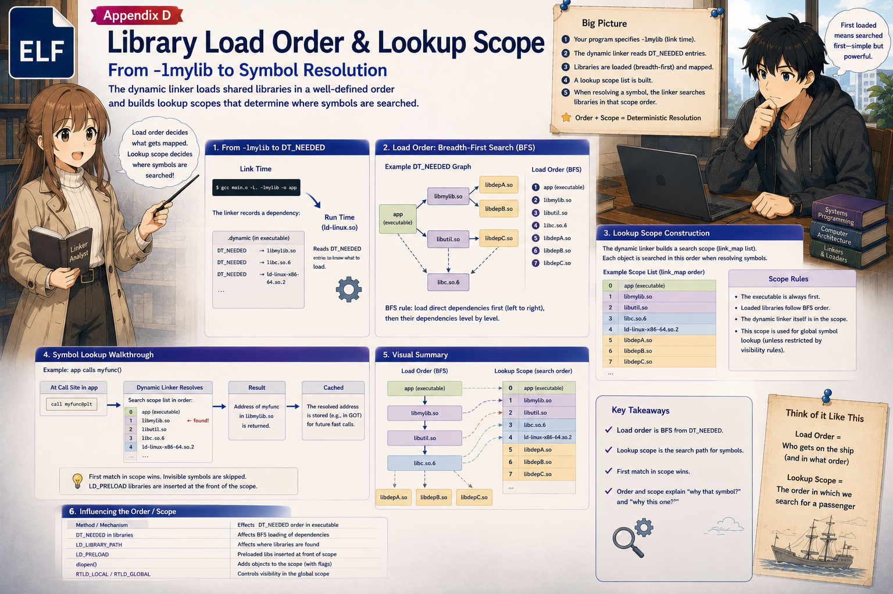

# 付録 D. ライブラリのロード順序と lookup scope

Step 5 で見た `main` の lookup scope の順序 (`main → libmylib.so →
libc.so.6 → ld-linux.so`) は、いったいどこから来たのか。本付録では、
開発者のリンク時指定から始まって、実行時の resolver の検索順序に至る
までの **一連の流れ** を追う。

---

## 全体の流れ

```
   [ビルド時]
      開発者              gcc ... -lmylib      (どの .so を、どの順で使うか)
         │
         ▼
      静的リンカ ld       main の .dynamic に DT_NEEDED を順に書く
         │
         ▼
   ── ELF ファイルに固定される ─────────────────────────────────

   [起動時]
      ld-linux.so         DT_NEEDED を依存の順にロード
         │
         ▼
                          main の lookup scope 表を作る
                          [0] main → [1] libmylib.so → [2] libc.so.6 → [3] ld-linux.so
         │
         ▼
   [初回関数呼び出し時]
      resolver            lookup scope を上から順に .dynsym で検索
                          → libmylib.so で add を発見
```

以下、それぞれの段階を詳しく見る。

---

## 段階 1. 開発者のコマンドライン

題材の `build.sh`:

```sh
gcc -o main main.c -L. -lmylib -Wl,-rpath,'$ORIGIN'
```

- `-lmylib` — 明示的に `libmylib.so` をリンクする指定
- gcc の driver が **暗黙で `-lc`** を追加 (`-nostdlib` などが無ければ)

つまり、静的リンカ (`binutils ld`) が受け取るコマンドラインは実質的には:

```
ld ... -lmylib -lc ...
```

の順になる。

---

## 段階 2. 静的リンカが DT_NEEDED を書く

静的リンカは、**コマンドラインの `-l` オプションを左から右へ** 処理し、
`main` の `.dynamic` に対応する `DT_NEEDED` エントリを書き込む。

`-lmylib` が先、`-lc` が後だったので:

```
main の .dynamic (抜粋):
   DT_NEEDED = libmylib.so   ← -lmylib から
   DT_NEEDED = libc.so.6     ← 暗黙の -lc から
```

Step 4 の生バイト dump で見たとおり、この順で並んで書き込まれる。この
時点で **順序は ELF ファイルに固定** される (以降は書き換えない)。

---

## 段階 3. ld-linux.so が依存を順にロード

起動時、`ld-linux.so` は Step 4 で見た手順で `DT_NEEDED` を辿って
**依存の順に** 依存ライブラリをロードする (正確には **幅優先 (BFS)**):

1. main の `.dynamic` から `DT_NEEDED` を先頭から順に取り出す
2. 順にロード (既にロード済みならスキップ)
3. ロード済み集合を上から順に走査し、各 `.so` の `DT_NEEDED` を
   さらに拾って追加
4. すべての依存が解決されるまで繰り返す

題材で辿ると:

- **Round 1**: main の `DT_NEEDED` を順に処理
  - `libmylib.so` を mmap
  - `libc.so.6` を mmap
- **Round 2**: 追加された順に各 `.so` の `DT_NEEDED` を処理
  - libmylib.so の `DT_NEEDED`: `libc.so.6` (既にあるのでスキップ)
  - libc.so.6 の `DT_NEEDED`: `ld-linux.so` (特殊、既にロード済み)

**最終的な link_map / lookup scope 順序**: `main → libmylib.so → libc.so.6 → ld-linux.so`
(この順は link_map の連結順であり、`mmap` の物理順ではない。`ld-linux.so` は Step 2 の通り最初にマップ済み)

---

## 段階 4. lookup scope 表ができる

`ld-linux.so` は 段階 3 のロード順で **main の lookup scope 表** を作る
(Step 7 § link_map の右側の表):

```
main の lookup scope (= main の link_map の l_scope が指す表):
   [0] main             ← ロード順の 1 番目
   [1] libmylib.so      ← ロード順の 2 番目
   [2] libc.so.6        ← ロード順の 3 番目
   [3] ld-linux.so      ← ロード順の 4 番目
```

つまり **`lookup scope` の実体は、`link_map` ポインタをロード順に
並べた表**。本書の題材では、この順序は `link_map` 連結リスト
(Step 7) の順と一致する。

---

## 段階 5. resolver がこの順で検索

Step 7 で追ったとおり、実行時に resolver は `main` の link_map の
`l_scope` から上の表を辿り、**上から順に** 各 ELF の `.dynsym` を
検索する:

- [0] main → `add` は UND (未定義) だけ、スキップ
- [1] libmylib.so → `add` 発見! → 実 VA `base_libmylib + 0x10f9` を返す

これで `add` の実 VA が求まる (Step 5 のシンボル解決)。

---

## まとめ

**開発者が指定した `-l` の順番** が、静的に `.dynamic` の `DT_NEEDED`
順序として焼き込まれ、実行時のロード順、lookup scope の順序、
そして最終的な検索順序へと、そのまま伝播する。

「どのライブラリのシンボルが優先されるか」は **リンク時のコマンド
ラインで決まっている** — これが動的リンクの検索順序が「実行の遥か前」
に決まっている理由でもある。

---

## 関連する章

- **Step 4 § DT_NEEDED を辿る** — `.dynamic` の中身と DT_NEEDED の生バイト
- **Step 5 § lookup scope** — lookup scope の概念と本書の題材での順序
- **Step 7 § link_map とは何か** — link_map と l_scope、実行時の resolver
